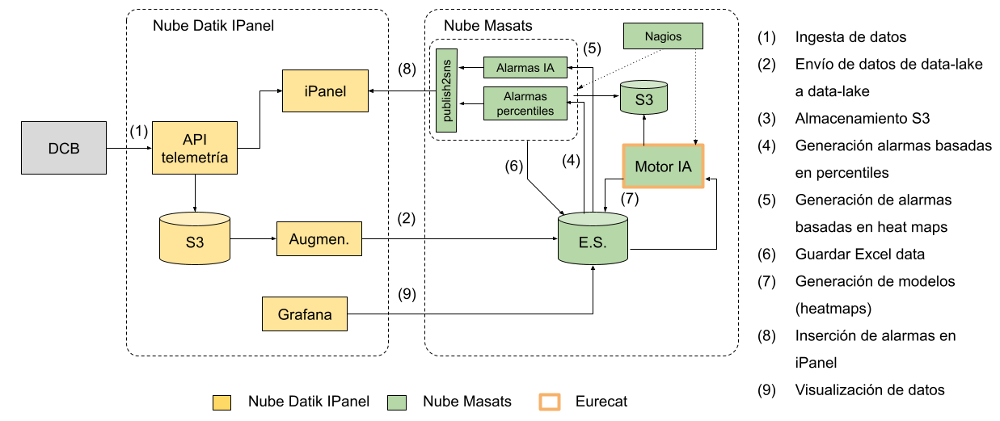

# predictivo_doc

Descripción del proyecto:

*   [DCB](./doc/dcb.md)
*   [AWS](./doc/aws.md)
*   [Integraciones](./doc/integrations.md)
*   [Grafana](./doc/grafana.md)

*   Ficheros de configuración para los DCBLs:
    *  Para [EMT](./config_files/emt_xmls/)
    *  Para [TMB](./config_files/tmb_xmls/)
    *  Para [Singapur](./config_files/singapur_xmls/)

* [Operaciones de mantenimiento](doc/operations.md)

* [Averiguar el origen del problema](doc/troubleshooting.md)

# Documentación

Google Drive [05_Entregables](https://drive.google.com/drive/folders/1p32cKrd071Z7WL4cqaRFP2gyuXFWgT3W)

# Arquitectura

El siguiente diagrama muestra la arquitectura por bloques del proyecto:


*[Fuente](https://docs.google.com/drawings/d/1JjMQQoz8_8YfxF3v_1XbeDX-ZcXJ-l8PsqIkNbw5w8Y/edit)*

Documento [PR18020 - Cloud Masats - Rev 2](https://docs.google.com/document/d/1_-IgVvtTBPygTHwbC7HMiRA4pVAZaJeSQRdFPezS3rY/edit#heading=h.7rall6tn32rg)

# Repositorios Gitlab

[ETL Scripts](https://git.datik.io/ingenieria/masats/etl-scripts)
Este repo contiene los scripts usados para tareas ETL de masats, están como binario en ~/bin en la máquina (CopyCat) de AWS. En cierto modo todo es ETL.
Los scripts en la carpeta ./bin están escritos principalmente en ```sh``` aunque es posible que haya algo de ```bash```), ```jq``` para procesar JSON, ```curl``` para peticiones HTTP, ```python``` y ```go```.
Los ```scripts``` se usan como servicio CRON. Su especificación está en el fichero ```masats.cron```.

[masats-bridge-api](https://git.datik.io/ingenieria/masats/masats-bridge-api)
API that acts as glue between an Elasticsearch (or any other DB, possibly) and the client Masats.

[masatsWeeklyNotifier](https://git.datik.io/ingenieria/masats/masatsWeeklyNotifier)
This repo contains the sh/R scripts to make the weekly report on ```masats_irizar``` manoeuvres. To create the pdf's and send them in the default way just type:

```console
$ sh run_on_mondays.sh
```

Estos repositorios fueron descartados pero finalmente han sido recuperados, por si contuvieran información útil:

[msts-rangos-et-percentiles](https://git.datik.io/ingenieria/masats/msts-rangos-et-percentiles)

[msts-predictive-project](https://git.datik.io/ingenieria/masats/msts-predictive-project)
This script generates the XML files that must be loaded into the DCBL in order to show them how to read from CAN the variables according to Masat's documentation.
Can config and (some ad hoc) processing files. The workflow is as follows: download the excel from whatever source, then make it a set of tsv (tab-separated-values files), and finally generate the xml files that power the reader app.

# Cálculo de alarmas por percentiles

El cálculo de alarmas por percentiles se realiza mediante un proceso ubicado en el servidor de [integraciones](./doc/integrations.md).

Los parámetros de configuración del proceso se encuentran en el Spreadsheet llamado [PR18020 - Percentiles configuracion](https://docs.google.com/spreadsheets/d/1J3arIo5QfibjAuUFvGGKT1aMzIja39w9GlXiPBodhbg/edit#gid=0)
